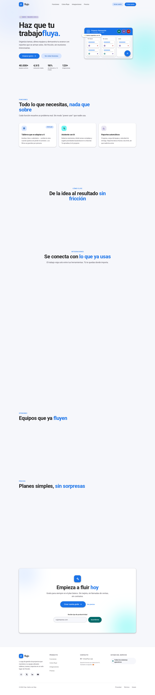

# ✨ Flujo — Landing Page

> **Tu trabajo fluye.** — Landing page de marca para *Flujo*, app de gestión de proyectos con estética **Material Design (Material 3)**.

Landing page estática construida con **Astro 7 + Tailwind CSS v4 + TypeScript**, preparada para **Cloudflare Pages**. Serie de 9 landing pages por estilo de diseño (este proyecto: **Material UI**).




---

## 🚀 Producción

| Recurso | URL |
|---|---|
| Producción (Cloudflare Pages) | `https://flujo.stevemoya.me` *(cuando conectes el repo)* |
| Preview Pages | `https://landing-flujo.pages.dev` |

---

## 🧱 Stack

- **Astro 7** — SSG puro, sin adaptador
- **Tailwind CSS v4** — tokens Material en `src/styles/global.css` (`@theme`)
- **TypeScript 5** estricto
- **@fontsource/roboto** auto-hospedada
- **Vanilla JS** — menú móvil, header scrolled, newsletter — CSP estricta sin `unsafe-eval` ni inline
- **`.node-version` (22.14.0)** + `assetsInlineLimit: 0` + `packageManager` pnpm — fixes CF v3 + CSP de la serie

## 📁 Arquitectura

```
src/
├── components/
│   ├── ui/          → Button (filled/tonal/outlined/text), Card (elev 1-3), Chip, Avatar, Icon, Section, Container
│   ├── layout/      → Header (app bar), Navigation, MobileMenu (vanilla JS), Footer
│   ├── sections/    → Hero (mockup app: app bar + kanban + FAB + IA), Features, Workflow, Integrations, Testimonials, Pricing, CTA+Newsletter
│   └── brand/       → Logo (flecha de flujo)
├── data/            → site, features, workflow, integrations, plans, testimonials
├── layouts/BaseLayout.astro  → SEO + OG + JSON-LD (SoftwareApplication)
├── pages/           → index.astro, 404.astro
├── scripts/         → header, reveal, newsletter
└── styles/global.css → Design System Material: superficies + elevación + reduce-motion
public/              → _headers (CSP), favicon.svg, robots.txt, og.png
```

## 🎨 Design System (Material 3)

| Token | Valor | Uso |
|---|---|---|
| `surface` / `surface-dim` | `#FFFFFF` / `#F6F7FB` | superficies y fondo |
| `primary` | `#1A73E8` | azul Material (acciones) |
| `secondary` / `tertiary` | teal `#006A6A` / violeta `#6750A4` | supportive |
| `error` | `#B3261E` | estados negativos |

- **Elevación en capas:** `shadow-elev-1..5` (sombra doble Material, sin blur excesivo)
- **Esquinas** 12–16px, chips pill, avatares con iniciales, FAB circular, app bar con tonal surface
- **Roboto** 400/500/700 (500 = títulos, la voz de Google)
- **Mockup de interfaz en el hero:** app bar real + tablero kanban de 3 columnas + FAB + chip flotante de IA
- **Interacciones:** ripple-light (active scale), hover con elevación +1, reveal on scroll

## 🛠️ Scripts

```bash
pnpm install
pnpm dev / build / preview / check
```

## ☁️ Deploy en Cloudflare Pages

1. [dash.cloudflare.com](https://dash.cloudflare.com) → **Workers & Pages → Create → Pages → Connect to Git** → repo `landing-flujo`.
2. Build: `pnpm build` · Output: `dist` · Node 22+ (`.node-version` ya lo fija).
3. Custom domain → `flujo.stevemoya.me`.

> ⚠️ Crearlo como **Pages**, no Worker. Si el build falla con *"error occurred while installing tools or dependencies"*, añade `NODE_VERSION=22.14.0` en Environment variables.

## 🛡️ Seguridad

- CSP estricta (`default-src 'self'`), HSTS, nosniff, frame DENY
- `vite.build.assetsInlineLimit: 0` → scripts siempre externos
- Sin secretos; `.env`/`.dev.vars` ignorados

## 📝 Decisiones

- **100 % CSS-first** + vanilla JS (CSP sin `unsafe-eval`)
- **Datos mock** — marca ficticia de portafolio
- Precios en USD/mes (Gratis $0 · Pro $12 · Empresas $24)

© 2026 Flujo — Proyecto de portafolio de Steve Moya.